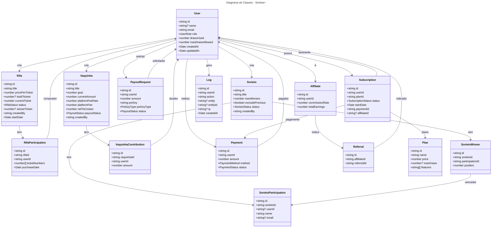

# 🧱 Sorteia+  

## Diagrama de Classes  

**Modelo UML de Entidades e Relacionamentos do Sistema**  
*Documento técnico — v1.0*

---

### 🧑‍💼 Fundador  

**Wellington Monteiro**  
📧 <wcsevendev@gmail.com>  

---

## 🎯 Objetivo

Este documento apresenta o **modelo de classes do sistema Sorteia+**, representando as **entidades principais**, seus **atributos**, **métodos** (opcionais) e **relacionamentos**, com base no banco de dados (Prisma) e nas regras de negócio.

Pode ser usado para:

- Gerar o schema do Prisma
- Criar entidades no backend
- Validar estrutura de dados
- Gerar diagrama visual (via Mermaid, PlantUML ou Draw.io)

---

## 🧩 Classes Principais

### 1. `User` (Usuário)

Representa qualquer pessoa no sistema: participante, criador, afiliado ou admin.

#### Atributos

- `id: string` (cuid)
- `name: string | null`
- `email: string` (único)
- `emailVerified: Date | null`
- `image: string | null`
- `role: UserRole` (USER, CREATOR_FREE, CREATOR_PRO, AFFILIATE, ADMIN)
- `password: string | null` (se usar login local)
- `createdAt: Date`
- `updatedAt: Date`
- `drawsUsed: number` (quantos sorteios criou)
- `maxDrawsAllowed: number` (3 para free, ilimitado para PRO)

#### Relacionamentos

- `rifas: Rifa[]` → cria
- `sorteios: Sorteio[]` → cria
- `vaquinhas: Vaquinha[]` → cria
- `affiliate: Affiliate | null` → é afiliado
- `subscription: Subscription | null` → plano pago
- `logs: Log[]` → ações registradas
- `notifications: Notification[]` → notificações

---

### 2. `Rifa` (Rifa Numerada)

Campanha de venda de números para sorteio de um prêmio.

#### Atributos

- `id: string`
- `title: string`
- `description: string | null`
- `pricePerTicket: number`
- `totalTickets: number | null` (null = ilimitado)
- `currentTicket: number` (próximo número disponível)
- `prize: string | null`
- `image: string | null`
- `status: RifaStatus` (ACTIVE, ENDED, CANCELLED)
- `startDate: Date`
- `endDate: Date | null`
- `winnerTicket: number | null`
- `winnerUserId: string | null`
- `createdBy: string`
- `createdAt: Date`
- `updatedAt: Date`

#### Relacionamentos

- `creator: User` ← criador
- `participations: RifaParticipation[]` → compras

---

### 3. `RifaParticipation` (Participação em Rifa)

Representa a compra de um ou mais números por um usuário.

#### Atributos

- `id: string`
- `rifaId: string`
- `userId: string`
- `ticketNumbers: number[]` (ex: [10, 11, 12])
- `purchaseDate: Date`
- `paymentId: string | null`

#### Relacionamentos

- `rifa: Rifa` ← rifa comprada
- `user: User` ← comprador
- `payment: Payment | null` ← pagamento associado

---

### 4. `Sorteio` (Sorteio Aleatório)

Sorteio entre participantes (nomes, e-mails, IDs).

#### Atributos

- `id: string`
- `title: string`
- `description: string | null`
- `prize: string | null`
- `image: string | null`
- `maxWinners: number` (1, 2, 3...)
- `excludePrevious: boolean` (evita vencedores anteriores)
- `status: SorteioStatus` (DRAFT, ACTIVE, DRAWN)
- `drawDate: Date | null`
- `createdBy: string`
- `createdAt: Date`
- `updatedAt: Date`

#### Relacionamentos

- `creator: User` ← criador
- `participants: SorteioParticipation[]` → inscritos
- `winners: SorteioWinner[]` → vencedores

---

### 5. `SorteioParticipation` (Inscrição em Sorteio)

Participante inscrito em um sorteio aleatório.

#### Atributos

- `id: string`
- `sorteioId: string`
- `userId: string | null` (se autenticado)
- `name: string` (pode ser anônimo)
- `email: string | null`
- `createdAt: Date`

#### Relacionamentos

- `sorteio: Sorteio` ← sorteio
- `user: User | null` ← usuário (opcional)

---

### 6. `SorteioWinner` (Vencedor de Sorteio)

Armazena os vencedores de um sorteio aleatório.

#### Atributos

- `id: string`
- `sorteioId: string`
- `participationId: string`
- `position: number` (1º, 2º, etc.)
- `notified: boolean`
- `notifyAt: Date | null`

#### Relacionamentos

- `sorteio: Sorteio` ← sorteio
- `participation: SorteioParticipation` ← inscrição vencedora

---

### 7. `Vaquinha` (Crowdfunding)

Campanha de arrecadação com meta.

#### Atributos

- `id: string`
- `title: string`
- `description: string | null`
- `goal: number`
- `currentAmount: number`
- `image: string | null`
- `status: VaquinhaStatus` (ACTIVE, COMPLETED, EXPIRED)
- `endDate: Date | null`
- `platformFeeRate: number` (5.0)
- `platformFee: number` (calculado)
- `netToCreator: number` (valor líquido)
- `payoutStatus: PayoutStatus` (PENDING, PAID)
- `createdBy: string`
- `createdAt: Date`
- `updatedAt: Date`

#### Relacionamentos

- `creator: User` ← criador
- `contributions: VaquinhaContribution[]` → doações

---

### 8. `VaquinhaContribution` (Contribuição)

Doação feita por um usuário em uma vaquinha.

#### Atributos

- `id: string`
- `vaquinhaId: string`
- `userId: string`
- `amount: number`
- `message: string | null`
- `createdAt: Date`
- `paymentId: string`

#### Relacionamentos

- `vaquinha: Vaquinha` ← campanha
- `user: User` ← doador
- `payment: Payment` ← pagamento

---

### 9. `Payment` (Pagamento)

Transação financeira no sistema.

#### Atributos

- `id: string`
- `userId: string`
- `amount: number`
- `currency: string` (BRL)
- `method: PaymentMethod` (PIX, CREDIT_CARD, INTERNAL_COINS)
- `status: PaymentStatus` (PENDING, APPROVED, REJECTED)
- `transactionId: string | null`
- `metadata: Json` (dados do gateway)
- `createdAt: Date`
- `updatedAt: Date`

#### Relacionamentos

- `user: User` ← pagador
- `logs: PaymentLog[]` → histórico

---

### 10. `PayoutRequest` (Solicitação de Saque)

Retirada de saldo por criador via Pix.

#### Atributos

- `id: string`
- `userId: string`
- `amount: number`
- `pixKey: string` (chave Pix)
- `pixKeyType: PixKeyType` (CPF, EMAIL, PHONE, RANDOM)
- `status: PayoutStatus` (PENDING, APPROVED, PAID, FAILED)
- `requestedAt: Date`
- `processedAt: Date | null`

#### Relacionamentos

- `user: User` ← solicitante

---

### 11. `Affiliate` (Afiliado)

Usuário que ganha comissão por indicar assinantes.

#### Atributos

- `id: string`
- `userId: string`
- `commissionRate: number` (30.0)
- `totalEarnings: number`
- `paidEarnings: number`
- `createdAt: Date`

#### Relacionamentos

- `user: User` ← afiliado
- `referrals: Referral[]` → indicados

---

### 12. `Referral` (Indicação)

Registro de um usuário indicado por um afiliado.

#### Atributos

- `id: string`
- `affiliateId: string`
- `referredId: string`
- `joinedAt: Date`

#### Relacionamentos

- `affiliate: Affiliate` ← quem indicou
- `referred: User` ← quem foi indicado

---

### 13. `Subscription` (Assinatura)

Plano pago do usuário.

#### Atributos

- `id: string`
- `userId: string`
- `planId: string`
- `status: SubscriptionStatus` (ACTIVE, CANCELLED, EXPIRED)
- `startDate: Date`
- `nextBilling: Date | null`
- `paymentId: string`
- `affiliateId: string | null` (se veio de afiliado)
- `createdAt: Date`
- `updatedAt: Date`

#### Relacionamentos

- `user: User` ← assinante
- `plan: Plan` ← tipo de plano
- `payment: Payment` ← pagamento da assinatura

---

### 14. `Plan` (Plano)

Definição de planos PRO e PRO+.

#### Atributos

- `id: string`
- `name: string` ("PRO", "PRO+")
- `price: number`
- `currency: string` ("BRL")
- `maxDraws: number | null` (3 ou null = ilimitado)
- `features: string[]` (["export", "bots", "priority"])
- `createdAt: Date`
- `updatedAt: Date`

#### Relacionamentos

- `subscriptions: Subscription[]` → assinaturas ativas

---

### 15. `Log` (Registro de Ações)

Auditoria de segurança e rastreabilidade.

#### Atributos

- `id: string`
- `userId: string`
- `action: string` ("created_rifa", "paid", "requested_payout")
- `entity: string | null` ("Rifa", "Vaquinha")
- `entityId: string | null`
- `details: Json | null` (informações adicionais)
- `ip: string | null`
- `userAgent: string | null`
- `createdAt: Date`

#### Relacionamentos

- `user: User` ← quem realizou a ação

---

## 🔗 Relacionamentos Principais (Resumo)

```text
User 1─────* Rifa
User 1─────* Sorteio
User 1─────* Vaquinha
User 1─────* Payment
User 1─────* Log

Rifa 1─────* RifaParticipation
Rifa *─────1 User (creator)

Sorteio 1─────* SorteioParticipation
Sorteio 1─────* SorteioWinner
Sorteio *─────1 User (creator)

Vaquinha 1─────* VaquinhaContribution
Vaquinha *─────1 User (creator)

Payment *─────1 User

PayoutRequest *─────1 User

Affiliate 1─────* Referral
Referral *─────1 User (referred)

Subscription *─────1 User
Subscription *─────1 Plan

##🖼️ *Representação em Mermaid (Diagrama de Classes)*

Você pode colar este código em qualquer editor que suporte Mermaid, como:

[Mermaid Live Editor](https://mermaid.live "Visualiza em modo Draw")



## 📎 *Como Usar Este Diagrama*

- **Para o backend:** Use como base para gerar modelos Prisma e serviços
- **Para o frontend:** Mapeie entidades para interfaces TypeScript
- **Para testes:** Crie cenários com base nos relacionamentos
- **Para apresentações:** Exporte o Mermaid como imagem

## 📎 *Contato*

**Wellington Monteiro**

- 📧 `wcsevendev@gmail.com`
- 🌐 `sorteia.plus`

© 2025 Sorteia+ – Todos os direitos reservados.
Documento técnico confidencial. Não distribuir sem autorização.
