# 🧩 Sorteia+  

## Diagrama de Casos de Uso  

**Modelo UML de Interações do Usuário com o Sistema**  
*Documento técnico — v1.0*

---

### 🧑‍💼 *Fundador*

**Wellington Monteiro**  
📧 <wcsevendev@gmail.com>  

---

## 🎯 *Objetivo*

Este documento descreve os **casos de uso do sistema Sorteia+**, detalhando as **interações entre os atores (usuários)** e as **funcionalidades do sistema**, com foco em:

- Criação de rifas, sorteios e vaquinhas
- Participação em sorteios
- Gestão financeira (pagamentos e saques)
- Programa de afiliados
- Autenticação e segurança

---

## 🧑 *Atores do Sistema*

| Ator | Descrição |
|------|----------|
| **Usuário (Participante)** | Pessoa que participa de sorteios, mas não cria |
| **Criador (Free/PRO)** | Usuário que cria rifas, sorteios ou vaquinhas |
| **Afiliado** | Criador que também promove a plataforma e ganha comissão |
| **Administrador** | Responsável por gerenciar o sistema, usuários e logs |
| **Sistema de Pagamento** | Gateway externo (Stripe, Mercado Pago) |

---

## 📋 *Casos de Uso por Ator*

### 1. 🧑 Usuário (Participante)

#### Casos de Uso

- `<<include>> Autenticar-se no sistema`
- `<<include>> Visualizar rifa ou vaquinha`
- `Comprar número de rifa`
- `Participar de sorteio aleatório`
- `Contribuir para vaquinha`
- `Visualizar resultado de sorteio`
- `Receber notificação de vitória`

#### Descrição: `Comprar número de rifa`

- **Ator:** Usuário
- **Pré-condição:** Rifa está ativa
- **Fluxo principal:**
  1. Usuário acessa a página da rifa
  2. Seleciona quantidade de números
  3. Escolhe método de pagamento (Pix ou cartão)
  4. Confirma pagamento
  5. Sistema registra participação e emite comprovante
- **Pós-condição:** Números reservados, pagamento confirmado

---

### 2. 🛠️ *Criador (Free / PRO)*

#### Casos de Uso

- `<<include>> Autenticar-se no sistema`
- `Criar rifa numerada`
- `Editar rifa`
- `Encerrar rifa`
- `Realizar sorteio`
- `Criar sorteio aleatório`
- `Criar vaquinha`
- `Visualizar arrecadação`
- `Solicitar saque via Pix`
- `Exportar resultado (PDF/CSV)`
- `Visualizar histórico de sorteios`

#### Descrição: `Criar rifa numerada`

- **Ator:** Criador
- **Pré-condição:** Usuário autenticado e com direito a criar (≤ 3 sorteios ou plano PRO)
- **Fluxo principal:**
  1. Criador acessa "Criar Rifa"
  2. Preenche título, preço, quantidade, prêmio
  3. Adiciona imagem (opcional)
  4. Confirma criação
  5. Sistema gera link de compartilhamento
- **Pós-condição:** Rifa publicada e disponível para venda

#### Descrição: `Solicitar saque via Pix`

- **Ator:** Criador
- **Pré-condição:** Ter saldo disponível (após arrecadação)
- **Fluxo principal:**
  1. Acessa "Financeiro"
  2. Visualiza saldo líquido
  3. Informa chave Pix
  4. Confirma saque
  5. Sistema cria solicitação (status: PENDING)
- **Pós-condição:** Saque em análise, notificação enviada

---

### 3. 🤝 *Afiliado*

#### Casos de Uso

- `<<include>> Autenticar-se no sistema`
- `Gerar link de afiliado`
- `Compartilhar link`
- `Visualizar ganhos`
- `Solicitar saque de comissão`
- `Visualizar indicados`

#### Descrição: `Gerar link de afiliado`

- **Ator:** Afiliado
- **Pré-condição:** Conta verificada
- **Fluxo principal:**
  1. Acessa "Programa de Afiliados"
  2. Sistema gera link: `sorteia.plus?ref=wellington123`
  3. Afiliado copia e compartilha
- **Pós-condição:** Link ativo e rastreável

#### Descrição: `Visualizar ganhos`

- **Ator:** Afiliado
- **Fluxo principal:**
  1. Acessa "Dashboard de Afiliado"
  2. Visualiza:
     - Total de indicados
     - Comissões geradas
     - Status de pagamento
  3. Pode filtrar por data
- **Pós-condição:** Dados atualizados em tempo real

---

### 4. 👨‍💼 *Administrador*

#### Casos de Uso

- `<<include>> Autenticar-se no sistema`
- `Gerenciar usuários`
- `Monitorar transações`
- `Aprovar saques`
- `Visualizar logs de segurança`
- `Gerar relatórios financeiros`
- `Suspender conta`
- `Configurar taxas (futuro)`

#### Descrição: `Aprovar saques`

- **Ator:** Administrador
- **Fluxo principal:**
  1. Acessa "Financeiro → Saques Pendentes"
  2. Verifica solicitação (usuário, valor, chave Pix)
  3. Confirma pagamento
  4. Sistema muda status para `PAID` e notifica
- **Pós-condição:** Saque processado

---

### 5. 💳 *Sistema de Pagamento (Gateway Externo)*

#### Casos de Uso

- `Processar pagamento (Pix/cartão)`
- `Enviar webhook de confirmação`
- `Notificar falha de pagamento`

> ⚠️ Este ator é externo ao sistema Sorteia+, mas essencial para integração.

---

## 🔄 *Relacionamentos entre Casos de Uso*

```text
<<include>> Autenticar-se no sistema
    ├─ Comprar número de rifa
    ├─ Criar rifa numerada
    ├─ Criar vaquinha
    ├─ Solicitar saque via Pix
    └─ Gerar link de afiliado

<<extend>> Realizar sorteio
    └─ (Opcional) Excluir vencedores anteriores

<<extend>> Criar vaquinha
    └─ (Automático) Aplicar taxa de 5%


# 🧩 *Sorteia+*
  3. Afiliado copia e compartilha
- **Pós-condição:** Link ativo e rastreável

#### Descrição: `Visualizar ganhos`
- **Ator:** Afiliado
- **Fluxo principal:**
  1. Acessa "Dashboard de Afiliado"
  2. Visualiza:
     - Total de indicados
     - Comissões geradas
     - Status de pagamento
  3. Pode filtrar por data
- **Pós-condição:** Dados atualizados em tempo real

---

### 4. 👨‍💼 *Administrador*

#### Casos de Uso:
- `<<include>> Autenticar-se no sistema`
- `Gerenciar usuários`
- `Monitorar transações`
- `Aprovar saques`
- `Visualizar logs de segurança`
- `Gerar relatórios financeiros`
- `Suspender conta`
- `Configurar taxas (futuro)`

#### Descrição: `Aprovar saques`
- **Ator:** Administrador
- **Fluxo principal:**
  1. Acessa "Financeiro → Saques Pendentes"
  2. Verifica solicitação (usuário, valor, chave Pix)
  3. Confirma pagamento
  4. Sistema muda status para `PAID` e notifica
- **Pós-condição:** Saque processado

---

### 5. 💳 *Sistema de Pagamento (Gateway Externo)*

#### Casos de Uso:
- `Processar pagamento (Pix/cartão)`
- `Enviar webhook de confirmação`
- `Notificar falha de pagamento`

> ⚠️ Este ator é externo ao sistema Sorteia+, mas essencial para integração.

---

## 🔄 *Relacionamentos entre Casos de Uso*

```text
<<include>> Autenticar-se no sistema
    ├─ Comprar número de rifa
    ├─ Criar rifa numerada
    ├─ Criar vaquinha
    ├─ Solicitar saque via Pix
    └─ Gerar link de afiliado

<<extend>> Realizar sorteio
    └─ (Opcional) Excluir vencedores anteriores

<<extend>> Criar vaquinha
    └─ (Automático) Aplicar taxa de 5%

## 🖼️ *Representação em Mermaid* (para gerar diagrama)
Você pode colar este código em qualquer editor que suporte Mermaid, como:

[Mermaid Live Editor](https://mermaid.live "Visualiza em modo Draw")

```mermaid
---
title: Diagrama de Casos de Uso - Sorteia+
---

graph TD
    A[Usuário] -->|Comprar número| CU1[Comprar número de rifa]
    A -->|Participar| CU2[Participar de sorteio aleatório]
    A -->|Contribuir| CU3[Contribuir para vaquinha]

    B[Criador] -->|Criar| CU4[Criar rifa numerada]
    B -->|Editar| CU5[Editar rifa]
    B -->|Encerrar| CU6[Encerrar rifa]
    B -->|Sortear| CU7[Realizar sorteio]
    B -->|Criar| CU8[Criar sorteio aleatório]
    B -->|Criar| CU9[Criar vaquinha]
    B -->|Solicitar| CU10[Solicitar saque via Pix]
    B -->|Exportar| CU11[Exportar resultado]

    C[Afiliado] -->|Gerar| CU12[Gerar link de afiliado]
    C -->|Visualizar| CU13[Visualizar ganhos]
    C -->|Solicitar| CU14[Solicitar saque de comissão]

    D[Admin] -->|Gerenciar| CU15[Gerenciar usuários]
    D -->|Aprovar| CU16[Aprovar saques]
    D -->|Visualizar| CU17[Visualizar logs]
    D -->|Gerar| CU18[Gerar relatórios]

    E[Gateway] -->|Processar| CU19[Processar pagamento]
    E -->|Enviar| CU20[Enviar webhook]

    Auth[<<include>> Autenticar-se] --> CU1
    Auth --> CU4
    Auth --> CU9
    Auth --> CU10
    Auth --> CU12

    Extend1[<<extend>> Excluir vencedores] --> CU7
    Extend2[<<extend>> Aplicar taxa 5%] --> CU9
```



## 📎 *Como Usar Este Diagrama*

Para desenvolvimento:
Use os casos de uso como base para sprints
Mapeie cada caso para uma funcionalidade no backend/frontend
Para documentação:
Inclua este arquivo na pasta /docs
Exporte o Mermaid como imagem para apresentações
Para testes:
Cada caso de uso vira um cenário de teste (ex: "Usuário compra número de rifa")

## 📎 *Contato*

Wellington Monteiro

### 📧 <wcsevendev@gmail.com>

### 🌐 <www.sorteia.plus>

*© 2025 Sorteia+ – Todos os direitos reservados*
**Documento técnico confidencial. Não distribuir sem autorização**
